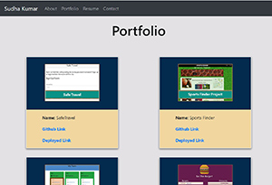

# sskportfolio

# Links to deployed application and repository:
* [Deployed Application](https://sskumar4.github.io/sskportfolio/)
* [Repository](https://github.com/sskumar4/sskportfolio)

# Project Name: SSKPortfolio
# Title: Sudha Kumar

# Introduction:
A react porfolio using boorstrap CSS Framework. Responsive design ensures that the web applications render well on a variety of devices or screen sizes

# Technologies:
Reactjs Bootstrap 4, HTML, CSS

# Features
Used sematic html
Created components
Developed the site using bootstrap with the following features:
  * Responsive navbar with About, Portfolio and Contact links on the left 
  * Responsive layout using grid system
  * Responsive images 
  * Used sub-rows and sub-columns
  * Added links to social media

# Launch

Launch [Deployed Application](https://sskumar4.github.io/ResponsivePortfolio/) to view the About page. Click on links on the left of the navigation bar to navigate to the respective pages. The portfolio page contains links the completed portfolios. The contact page contains a form to send message to the site owner.

